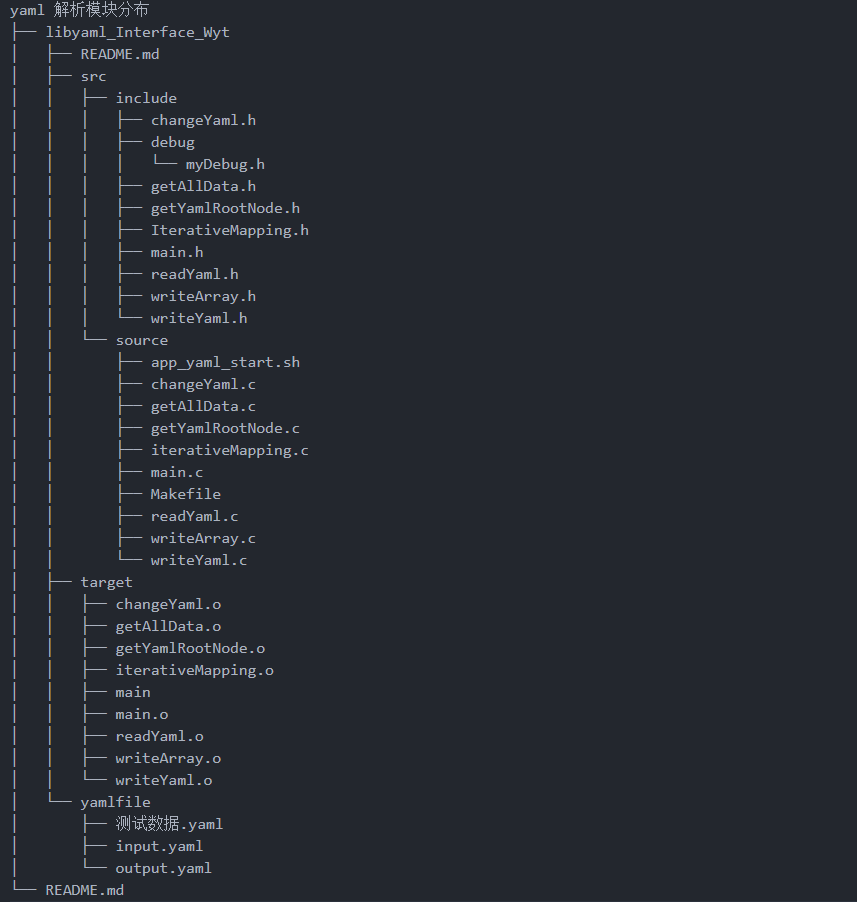

<!--
 * @Author: Wyt 1697556601@qq.com
 * @Date: 2024-08-08 00:26:58
 * @LastEditors: Wyt 1697556601@qq.com
 * @LastEditTime: 2024-08-10 22:52:21
 * @FilePath: /libyaml_Interface_Wyt/README.md
 * @Description: 
 * 
 * Copyright (c) 2024 by Wyt, All Rights Reserved. 
-->
# libyaml_Interface_Wyt
基于C语言的libyaml库进行封装完善工作。主要是进行接口函数的编写。

yaml 解析模块分布
├── libyaml_Interface_Wyt
│   ├── README.md
│   ├── src
│   │   ├── include
│   │   │   ├── changeYaml.h
│   │   │   ├── debug
│   │   │   │   └── myDebug.h
│   │   │   ├── getAllData.h
│   │   │   ├── getYamlRootNode.h
│   │   │   ├── IterativeMapping.h
│   │   │   ├── main.h
│   │   │   ├── readYaml.h
│   │   │   ├── writeArray.h
│   │   │   └── writeYaml.h
│   │   └── source
│   │       ├── app_yaml_start.sh
│   │       ├── changeYaml.c
│   │       ├── getAllData.c
│   │       ├── getYamlRootNode.c
│   │       ├── iterativeMapping.c
│   │       ├── main.c
│   │       ├── Makefile
│   │       ├── readYaml.c
│   │       ├── writeArray.c
│   │       └── writeYaml.c
│   ├── target
│   │   ├── changeYaml.o
│   │   ├── getAllData.o
│   │   ├── getYamlRootNode.o
│   │   ├── iterativeMapping.o
│   │   ├── main
│   │   ├── main.o
│   │   ├── readYaml.o
│   │   ├── writeArray.o
│   │   └── writeYaml.o
│   └── yamlfile
│       ├── 测试数据.yaml
│       ├── input.yaml
│       └── output.yaml
└── README.md

src目录: 主要存放接口代码。
    - include目录：接口代码的头文件目录。
        - debug目录：调试常用的系统及头文件目录方便调用所设此目录。
    - source目录：接口代码的源文件目录。

target目录：GCC编译的过程文件以及可执行文件的存放目录。

yamlfile目录：用来存放yaml文件的目录。

