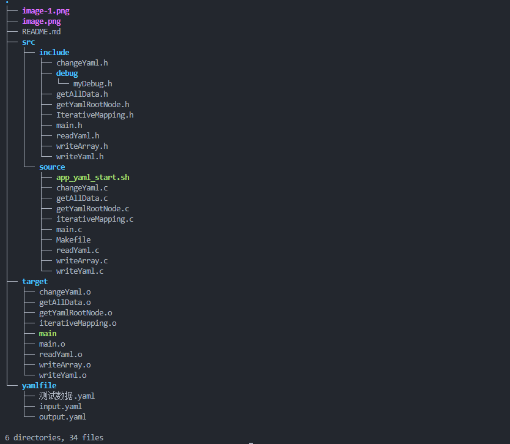
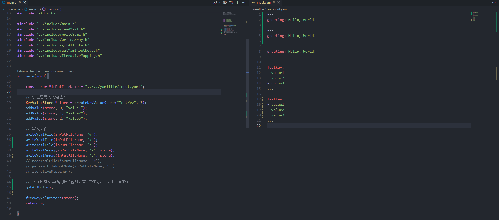

## Welcome to this repository

<a href="https://info.flagcounter.com/vhOC"></a>


#### The environment and software version used are:

 		 		 		

| **Ubuntu 22.04.4 LTS** |
| ------------------ |
| **GCC version 11.4.0** |
| **libyaml-2.0.9**      |

基于C语言的libyaml库进行封装完善工作。主要是进行接口函数的编写。

src目录: 主要存放接口代码。

​	- source目录：接口代码的源文件目录。

​	- include目录：接口代码的头文件目录

​		- debug目录：调试常用的系统及头文件目录方便调用所设此目录。

target目录：GCC编译的过程文件以及可执行文件的存放目录。

yamlfile目录：用来存放yaml文件的目录。

### 执行方式(method of application)

```bash
cd src/source
sudo chmod  +x  app_yaml_start.sh
./app_yaml_start.sh
```



写入键值:


写入数组:


写入序列:

读取:


## 鸣谢

感谢libyaml官方的开源. [libyaml](https://github.com/yaml/libyaml)
